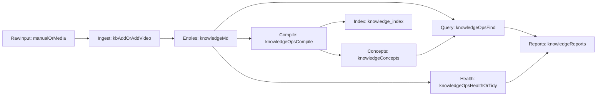

# ai-knowledge-vault

`ai-knowledge-vault` is a local-first AI knowledge vault template for Obsidian + Claude Code.  
It is designed not to help you "take more notes", but to connect raw sources, structured knowledge, query outputs, and ongoing health checks into one compounding system.

Chinese documentation: [README.md](./README.md)

## What This Is (2.0 Positioning)

This repository is the **2.0 upgrade** of your personal AI knowledge vault workflow:  
inspired by Andrej Karpathy's knowledge workflow, and engineered into a reusable structure with clear directories, CLI commands, and an Obsidian-native frontend.

In short:

- 1.0: personal scripts and ad-hoc workflow
- 2.0: reusable vault template + explicit input/process/output loop + continuous health checks

## Why It Matters

- **Higher retrieval efficiency**: read index + concept layer first, then expand raw evidence only when needed.
- **Better traceability**: entries keep full `Original Content`, so conclusions can be traced back to sources.
- **Sustainable maintenance**: `compile/find/health/tidy` keeps the vault evolving instead of degrading over time.

## Method Lineage and Project Mapping

Karpathy's `raw -> LLM compile wiki -> Q&A -> output feedback loop -> health checks` maps to this repo as:

- `raw data ingest` -> `knowledge/inbox/manual/pending/` and `knowledge/inbox/video/raw/`
- `LLM compile wiki` -> `python3 .claude/skills/kb/scripts/knowledge_ops.py compile`
- `Q&A against wiki` -> `python3 .claude/skills/kb/scripts/knowledge_ops.py find "query"`
- `output feedback loop` -> query outputs accumulate in `knowledge/reports/` and can be promoted back into entries
- `linting / health checks` -> `python3 .claude/skills/kb/scripts/knowledge_ops.py health` and `tidy`

## System Loop



Three practical flows:

1. **Ingest flow**: raw materials enter `inbox`, become `knowledge/*.md` entries  
2. **Compile flow**: `compile` builds concept pages and index  
3. **Query and health flow**: `find/health/tidy` produces reports and improves quality

## Layered Architecture

- **Content layer (source of truth)**: `knowledge/`
  - `knowledge/*.md`: timeline entries with source and distilled insights
  - `knowledge/concepts/`: compiled concept navigation layer
  - `knowledge/reports/`: reusable query/health outputs
- **Automation layer**: `.claude/skills/kb/`
  - `SKILL.md`: `/kb` command contract
  - `scripts/knowledge_ops.py`: `find/compile/health/tidy`
  - `scripts/video_ingest.py`: media ingest and transcription
- **Consumption layer**: Obsidian + Claude Code
  - Obsidian for browsing, linking, and visualization
  - Claude Code for incremental maintenance and research Q&A

## 5-Minute Quickstart (Minimum Loop)

### 1) Install

```bash
git clone https://github.com/dingshuxin353/ai-knowledge-vault.git
cd ai-knowledge-vault
pip3 install -r requirements.txt
```

### 2) Prepare one pending source

Put any Markdown file into `knowledge/inbox/manual/pending/`, or use `/kb add` in Claude Code.  
If you prepared multiple pending files, run `/kb process-pending` in Claude Code.

### 3) Compile concepts and index

```bash
python3 .claude/skills/kb/scripts/knowledge_ops.py compile
```

### 4) Run one query and persist a report

```bash
python3 .claude/skills/kb/scripts/knowledge_ops.py find "your-topic-keyword"
```

### 5) Run one health check

```bash
python3 .claude/skills/kb/scripts/knowledge_ops.py health
```

Expected outputs:

- entries: `knowledge/*.md`
- concepts: `knowledge/concepts/*.md`
- index: `knowledge/_index.md`
- reports: `knowledge/reports/*.md`

## Two-Layer Retrieval Model

- Layer 1: read `knowledge/_index.md` + `knowledge/concepts/*.md` to locate scope quickly
- Layer 2: open specific `## Original Content` blocks only when detail-level evidence is required

This layered retrieval often works well for small-to-medium personal vaults without heavy RAG infrastructure.

## Directory Map (Key Paths)

```text
knowledge/
  _index.md
  concepts/
  reports/
  inbox/
    manual/
      pending/
      processed/
      review/
    video/
      raw/
      transcripts/
      logs/
.claude/skills/kb/
docs/
```

Note: this repo is a template. The full content in `knowledge/concepts/` is usually generated incrementally after you run `compile`.

## Optional: Video/Audio Transcription

Requirements:

- `pip3 install dashscope`
- installed `ffmpeg` and `ffprobe`
- configured `.claude/skills/kb/config.local.json` (or `DASHSCOPE_API_KEY`)

Run:

```bash
python3 .claude/skills/kb/scripts/video_ingest.py
```

See [`docs/video-transcription.md`](./docs/video-transcription.md) for details.

## Who It Is For / Not For

Best for:

- people who want long-term research materials to compound into an AI-operable system
- people who want local, portable, and traceable Markdown-based personal wiki workflows
- people who want every query output to accumulate back into their vault

Probably not for:

- temporary note-taking with no structured maintenance needs
- users expecting zero-config hosted SaaS without local files/scripts

## Documentation Entry Points

- architecture: [`docs/architecture.md`](./docs/architecture.md)
- installation: [`docs/installation.md`](./docs/installation.md)
- video transcription: [`docs/video-transcription.md`](./docs/video-transcription.md)
- concepts directory: [`knowledge/concepts/README.md`](./knowledge/concepts/README.md)
- reports directory: [`knowledge/reports/README.md`](./knowledge/reports/README.md)
- manual ingest directory: [`knowledge/inbox/manual/README.md`](./knowledge/inbox/manual/README.md)
- video ingest directory: [`knowledge/inbox/video/README.md`](./knowledge/inbox/video/README.md)

## Suggested Next Steps

- add 5-10 source files into `knowledge/inbox/manual/pending/`
- run `compile + find + health` once and inspect how concepts and reports connect
- extend `.claude/skills/kb/scripts/` with your domain-specific strategies

## License

MIT
