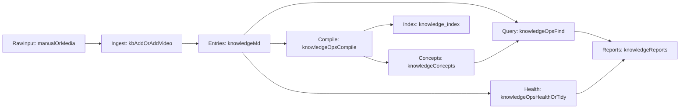

# ai-knowledge-vault

`ai-knowledge-vault` 是一个面向 Obsidian + Claude Code 的本地优先 AI 知识库模板：用 Markdown 管理 `knowledge/` 下的条目、索引与收件箱。

英文说明见 [README.en.md](./README.en.md)。

## 这是什么

这是我在自己一直在用的 **AI 知识库** 做法上继续迭代的一版：1.0版本说明我写在飞书：https://mcndg9yue1j0.feishu.cn/wiki/D6rPw8SnVizcq3kbtIVcqtAKn3f
在这个仓库里，我把那套思路开源成可直接克隆的目录约定，并吸收了 **Andrej Karpathy** 公开分享过的个人知识库想法——原始材料先进库、再由模型参与整理成可浏览的 Markdown 结构、平时以问答和报告迭代、辅以体检把结构保持干净。

## 主要特性

- **本地优先**：内容落在 `knowledge/*.md`，Obsidian 打开即可协作阅读。
- **inbox → 正式条目**：手动素材走 `inbox/manual/`（`pending` / `processed` / `review`）；音视频可走 `inbox/video/` 并可选转写。
- **先索引再深入**：`knowledge/_index.md` 与 `knowledge/concepts/` 适合作为检索入口，需要细节再打开单篇的 `## 原始内容`。
- **编译与导航**：`compile` 维护概念层与索引关联。
- **查询可沉淀**：`find` 支持把主题检索整理进 `knowledge/reports/`。
- **健康与整理**：`health` / `tidy` 做结构检查与归一化。
- **Claude Code**：`.claude/skills/kb/` 提供 `/kb` 工作流（见 `.claude/skills/kb/SKILL.md`）。

## 系统逻辑闭环




三条常用流：

1. **入库流**：原始资料进入 `inbox`，形成 `knowledge/*.md` 知识条目
2. **编译流**：`compile` 生成概念层与索引，形成导航网络
3. **查询与体检流**：`find/health/tidy` 产出报告并反哺知识库质量

## 分层架构

- **内容层（Source of Truth）**：`knowledge/`
  - `knowledge/*.md`：时间线知识条目（原始内容 + 核心观点）
  - `knowledge/concepts/`：编译后的概念导航层
  - `knowledge/reports/`：查询报告与健康检查报告
- **自动化层（Automation）**：`.claude/skills/kb/`
  - `SKILL.md`：`/kb` 命令约定
  - `scripts/knowledge_ops.py`：`find/compile/health/tidy`
  - `scripts/video_ingest.py`：音视频入库与转写
- **消费层（Frontend & Agent）**：Obsidian + Claude Code
  - Obsidian 用于浏览、链接、可视化
  - Claude Code 负责增量维护和问答研究

## 5 分钟快速跑通（最小闭环）

### 1) 安装

```bash
git clone https://github.com/dingshuxin353/ai-knowledge-vault.git
cd ai-knowledge-vault
pip3 install -r requirements.txt
```

### 2) 准备一条待处理素材

把任意 Markdown 放到 `knowledge/inbox/manual/pending/`，或在 Claude Code 里使用 `/kb add`。
如果你已经批量放入了 `pending/`，可继续在 Claude Code 中执行 `/kb process-pending` 进行入库整理。

### 3) 编译概念层与索引

```bash
python3 .claude/skills/kb/scripts/knowledge_ops.py compile
```

### 4) 做一次查询并沉淀报告

```bash
python3 .claude/skills/kb/scripts/knowledge_ops.py find "你的主题关键词"
```

### 5) 做一次健康检查

```bash
python3 .claude/skills/kb/scripts/knowledge_ops.py health
```

按上述步骤执行后，预期会得到类似产物：

- 知识条目：`knowledge/*.md`
- 概念层：`knowledge/concepts/*.md`
- 索引入口：`knowledge/_index.md`
- 报告输出：`knowledge/reports/*.md`

## 两层检索机制（为什么它在小中规模很实用）

- 第一层：读取 `knowledge/_index.md` + `knowledge/concepts/*.md`，先定位主题和范围
- 第二层：按需展开具体条目的 `## 原始内容`，只在必要时读取细节证据

这种分层可以在不引入复杂 RAG 工程的前提下，在个人知识库规模内保持较好的查询质量与响应效率。

## 目录地图（关键部分）

```text
knowledge/
  _index.md
  concepts/
  reports/
  inbox/
    manual/
      pending/
      processed/
      review/
    video/
      raw/
      transcripts/
      logs/
.claude/skills/kb/
docs/
```

说明：本仓库以模板形式分发，`knowledge/concepts/` 下的概念页通常需要在本地运行 `compile` 后逐步生成。

## 可选能力：视频/音频转写

需要：

- `pip3 install dashscope`
- 已安装 `ffmpeg` 与 `ffprobe`
- 配置 `.claude/skills/kb/config.local.json`（或 `DASHSCOPE_API_KEY`）

运行：

```bash
python3 .claude/skills/kb/scripts/video_ingest.py
```

更多细节见 `[docs/video-transcription.md](./docs/video-transcription.md)`。

## 适合谁 / 不适合谁

适合：

- 想把长期研究资料沉淀为可被 AI 持续操作的知识系统
- 想在本地 Markdown 上构建可迁移、可追溯的个人 wiki
- 想让每次问答结果都“累积进知识库”而非一次性对话

不适合：

- 只需要临时笔记，不需要结构化维护
- 期望零配置云托管 SaaS 体验，不想维护本地文件与脚本

## 文档入口

- 架构说明：`[docs/architecture.md](./docs/architecture.md)`
- 安装指南：`[docs/installation.md](./docs/installation.md)`
- 视频转写说明：`[docs/video-transcription.md](./docs/video-transcription.md)`
- 概念层目录说明：`[knowledge/concepts/README.md](./knowledge/concepts/README.md)`
- 报告目录说明：`[knowledge/reports/README.md](./knowledge/reports/README.md)`
- 手动入库目录说明：`[knowledge/inbox/manual/README.md](./knowledge/inbox/manual/README.md)`
- 视频入库目录说明：`[knowledge/inbox/video/README.md](./knowledge/inbox/video/README.md)`

## 下一步建议

- 先向 `knowledge/inbox/manual/pending/` 放入少量原始材料试跑
- 执行一次 `compile + find + health`，观察概念层与报告如何联动
- 按自身主题与领域，扩展 `.claude/skills/kb/scripts/` 中的处理策略

## 开源许可

MIT License
